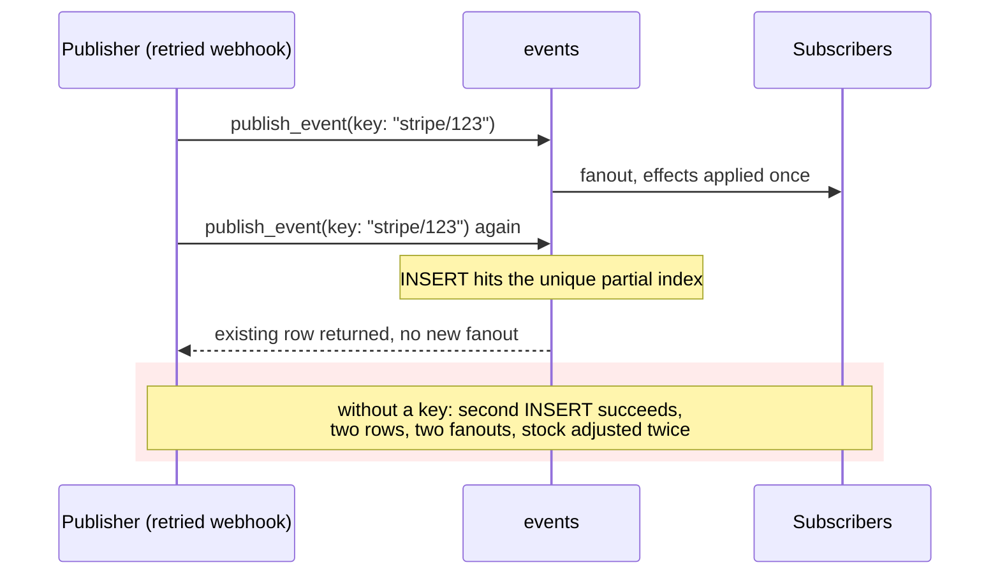

# Rails Vanilla Domain Events

Durable domain events in plain Rails, built up chapter by chapter. No event gem, no bus framework, no message broker: Active Record, a concern, Active Job, and a recurring job carry the whole thing.

This repo exists to make one argument, in the spirit of [Vanilla Rails is plenty](https://dev.37signals.com/vanilla-rails-is-plenty/): before reaching for wisper, Kafka, or an eventing framework, check what the framework you already run gives you.

A guiding principle follows from that argument: lean on Rails and Solid Queue internals as far as they go (transactions, `after_create_commit`, `retry_on`, failed executions, recurring tasks) and only write code where the framework stops. Every line added in the chapters answers a question the stack does not.

Domain: an `Order` you can place, pay, and ship. Paying records an `order.paid` event; two subscribers react (customer confirmation, inventory adjustment).

> [!WARNING]
> This is an experiment, not battle-tested production code. The mechanics are exercised by the test suites on each chapter branch, but the pattern has not carried production traffic. Read it as a reference implementation to study and adapt, not as something to vendor in as-is.

## Run it

```sh
bin/setup --skip-server
bin/rails test
bin/demo        # the guided walkthrough from chapter 1, still green
```

## How to read this repo

Reliable eventing is a chain of questions, each one only askable once the previous is answered. This repo is organized as that chain: `main` states the problem and holds the naive starting point (`Rails.event.notify`, a log line and nothing more); each chapter lives on its own branch, takes the next question, changes the code to answer it, and extends this same document. This branch is chapter 5.

Earlier chapters are not repeated here; each link below goes to that chapter's README.

1. [Did we tell the queue?](https://github.com/wcalderipe/rails-vanilla-domain-events/tree/1-did-we-tell-the-queue)
2. [Did the thing actually happen?](https://github.com/wcalderipe/rails-vanilla-domain-events/tree/2-did-the-thing-actually-happen)
3. [Which subscriber is actually done?](https://github.com/wcalderipe/rails-vanilla-domain-events/tree/3-which-subscriber-is-actually-done)
4. [Who guards the guard?](https://github.com/wcalderipe/rails-vanilla-domain-events/tree/4-who-guards-the-guard)
5. **Did we say it twice? (📍 you're here)**
6. [In what order do facts arrive?](https://github.com/wcalderipe/rails-vanilla-domain-events/tree/6-in-what-order-do-facts-arrive)
7. [What exactly did we say?](https://github.com/wcalderipe/rails-vanilla-domain-events/tree/7-what-exactly-did-we-say)
8. [How long do we remember?](https://github.com/wcalderipe/rails-vanilla-domain-events/tree/8-how-long-do-we-remember)
9. [What breaks when we leave SQLite?](https://github.com/wcalderipe/rails-vanilla-domain-events/tree/9-what-breaks-when-we-leave-sqlite)

## Question 5: Did we say it twice?

Everything so far dedupes the journey of one event: the same row can be re-announced, re-enqueued, and re-delivered, and exactly one effect survives. None of it dedupes the fact itself. Call `publish_event` twice for the same payment and you get two rows with two ids; both fan out, and the stock is adjusted twice for one payment. Delivery idempotency and publication idempotency are different problems, and only the first one was solved.

### Every existing defense, and where it stops

The proving tests walk each layer against the same scenario, one test per defense (`test/models/event_publication_test.rb`):

1. Event-id dedup (`Inventory::Adjustment`, unique on `event_id`) catches duplicate deliveries of one row. Two publications are two rows with two ids, so it applies both. This is the layer people expect to catch it, and it cannot.
2. Natural-key dedup (`Order::Confirmation`, unique on `order_id`) happens to absorb the duplicate, but only because its key is domain-scoped. That is luck of the key choice, not a property of the mechanism: the previous defense uses the same mechanism and fails.
3. Delivery records (chapter 3) dedupe per (event, subscriber). Two events mean two deliveries per subscriber, both legitimate from where they stand.
4. The relay never duplicates a publication. It re-announces an existing row; it cannot mint a second one.
5. The domain's own unique state records protect anchored facts: a second `Order#pay` dies on the `order_payments` unique index before its event row exists, and the duplicate fact rolls back with the losing transaction. But that only covers facts that have such an anchor.

Each layer is doing its job correctly. None of them owns publication identity, so something has to.

### Two classes of publication

The fifth defense is the interesting one, because it splits publications into two classes:

A fact anchored in a unique state record needs nothing. `Order#pay` creates the payment and publishes the event in one transaction; the payment's unique index means that transaction cannot commit twice, and the event rides on that guarantee. This is why the emitters in `Order` carry no key: leaving them bare is the proof that the class exists.

A free-standing fact, published with no accompanying uniquely-constrained write, has no anchor. Webhook handlers reprocessing a provider callback, backfill scripts run twice, an import re-executed after a partial failure: these are the publishers that say things twice. They need to carry their identity explicitly:

```ruby
order.publish_event("order.paid", idempotence_key: "stripe/#{order_id}", ...)
```

### The mechanism: the consumers' grammar, one layer up

`events.idempotence_key` is a nullable column with a unique partial index (`WHERE idempotence_key IS NOT NULL`). `publish_event` inserts first and rescues `RecordNotUnique` by returning the already-recorded fact:

```ruby
def publish_event(action, idempotence_key: nil, **payload)
  events.create!(action:, payload:, idempotence_key:)
rescue ActiveRecord::RecordNotUnique
  raise if idempotence_key.nil?
  Event.find_by!(idempotence_key:)
end
```

Insert-first, not check-then-act: a lookup before the insert would race exactly the way the consumers avoid by rescuing their unique indexes. The key joins the `attr_readonly` list because it is part of the fact. Republishing becomes a no-op that hands back the recorded event, so the caller cannot tell (and does not need to know) whether it was first.

One detail in the rescue is easy to get wrong and worth stating: recovery reads through `Event`, not the `events` association. The index is **global** — a key is unique across *every* eventable, which is what makes it a free-standing identity (a Stripe event id belongs to the fact, not to one order). A scoped `events.find_by!` would look only inside the current eventable and raise `RecordNotFound` the moment the same key was first recorded against a different record — precisely the cross-record duplicate a global key exists to collapse. The index and the lookup have to agree on scope; both are global. Pinned in `test/models/event_publication_test.rb`.



One honesty note for later: rescuing `RecordNotUnique` inside the caller's open transaction is fine on SQLite, where a failed statement does not poison the transaction. On PostgreSQL it does, and this rescue needs a savepoint around the insert. The consumers carry the same caveat; both belong to question 9.

### Why the key has no default

A default would have to be derived, and both derivations fail against this repo's own domain. Keying by the record alone gives `order.placed`, `order.paid`, and `order.shipped` the same key: two of the three facts silently vanish. Keying by record plus action survives the Order lifecycle, but only because those facts are anchored in unique state records and were already safe without a key; the same default silently drops the second occurrence of any legitimately repeatable fact (a `user.name.updated` that happens twice is two real facts).

The two failure costs are not symmetric. A missing key produces a duplicate effect: visible, and absorbed by idempotent consumers. A wrong default produces a fact that was never recorded: invisible and unrecoverable, in a log whose whole promise is that committed facts exist. Between duplicating and losing silently, every layer of this repo chooses duplicating; publication is no place to break the pattern.

Publication identity is domain knowledge, the same reason each consumer picks its own dedup key. Anchored facts need no key. Free-standing facts with a natural identity pass one. Repeatable facts must not have one. A default would erase the third category.

### The limit: same fact once, but in what order?

The key gives a fact identity, so saying it twice collapses into saying it once. It says nothing about when a fact lands relative to its neighbors: consumers can still observe `order.shipped` before `order.paid` under retries and redeliveries. Ordering is the next question: **In what order do facts arrive?**
