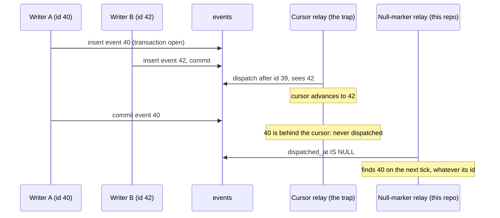

# Rails Vanilla Domain Events

Durable domain events in plain Rails, built up chapter by chapter. No event gem, no bus framework, no message broker: Active Record, a concern, Active Job, and a recurring job carry the whole thing.

This repo exists to make one argument, in the spirit of [Vanilla Rails is plenty](https://dev.37signals.com/vanilla-rails-is-plenty/): before reaching for wisper, Kafka, or an eventing framework, check what the framework you already run gives you.

A guiding principle follows from that argument: lean on Rails and Solid Queue internals as far as they go (transactions, `after_create_commit`, `retry_on`, failed executions, recurring tasks) and only write code where the framework stops. Every line added in the chapters answers a question the stack does not.

Domain: an `Order` you can place, pay, and ship. Paying records an `order.paid` event; two subscribers react (customer confirmation, inventory adjustment).

> [!WARNING]
> This is an experiment, not battle-tested production code. The mechanics are exercised by the test suites on each chapter branch, but the pattern has not carried production traffic. Read it as a reference implementation to study and adapt, not as something to vendor in as-is.

## Run it

```sh
bin/setup --skip-server
bin/rails test
bin/demo        # the guided walkthrough from chapter 1, still green
```

## How to read this repo

Reliable eventing is a chain of questions, each one only askable once the previous is answered. This repo is organized as that chain: `main` states the problem and holds the naive starting point (`Rails.event.notify`, a log line and nothing more); each chapter lives on its own branch, takes the next question, changes the code to answer it, and extends this same document. This branch is chapter 9.

Earlier chapters are not repeated here; each link below goes to that chapter's README.

1. [Did we tell the queue?](https://github.com/wcalderipe/rails-vanilla-domain-events/tree/1-did-we-tell-the-queue)
2. [Did the thing actually happen?](https://github.com/wcalderipe/rails-vanilla-domain-events/tree/2-did-the-thing-actually-happen)
3. [Which subscriber is actually done?](https://github.com/wcalderipe/rails-vanilla-domain-events/tree/3-which-subscriber-is-actually-done)
4. [Who guards the guard?](https://github.com/wcalderipe/rails-vanilla-domain-events/tree/4-who-guards-the-guard)
5. [Did we say it twice?](https://github.com/wcalderipe/rails-vanilla-domain-events/tree/5-did-we-say-it-twice)
6. [In what order do facts arrive?](https://github.com/wcalderipe/rails-vanilla-domain-events/tree/6-in-what-order-do-facts-arrive)
7. [What exactly did we say?](https://github.com/wcalderipe/rails-vanilla-domain-events/tree/7-what-exactly-did-we-say)
8. [How long do we remember?](https://github.com/wcalderipe/rails-vanilla-domain-events/tree/8-how-long-do-we-remember)
9. **What breaks when we leave SQLite? (📍 you're here)**

## Question 9: What breaks when we leave SQLite?

Eight chapters of guarantees, built and tested on one engine. The honest closing question is which of those guarantees belong to the design and which were being quietly donated by SQLite. This chapter maps the cliff without jumping: no Postgres in the Gemfile, no advisory locks, no cursor. One real code change lands (savepoints, below) because it is cheap now and load-bearing later; everything else is documentation of what the migration must respect.

### What SQLite donates: total, gapless emission order

Chapter 6 named it: SQLite allows one writer at a time in any journal mode, so appends serialize, ids follow commit order, and no id is ever visible while a smaller one is still uncommitted. Postgres removes all of that. Writers run concurrently, ids are assigned at insert but commits interleave, so event 42 can be committed and visible while event 40 sits in an open transaction. Total order across streams is gone; even per-stream order is no longer free. The mitigations are known and deliberately not built here: per-stream advisory locks for aggregate ordering, or Rails Event Store's linearized repository shape for a gapless global position. Build them when a consumer actually needs ordering, not before.

### The cursor trap

The relay scans `dispatched_at IS NULL`. That scan is gap-safe by construction: a late-committing event still surfaces as undispatched on a later tick, no matter what ids landed around it. The tempting optimization, replacing the scan with a high-water-mark cursor ("dispatch everything after the last id I saw"), reintroduces silent loss the moment commits interleave: the cursor advances past 42 and never returns for 40. The null-marker scan is load-bearing. Do not replace it on Postgres without linearizing appends first.



### Races the single writer was hiding

`Event#dispatch` guards with `return if dispatched?`, a check-then-act. On SQLite the writes serialize anyway; on Postgres two dispatchers can both pass the guard and both fan out. The same applies to the sweeps reading their candidates. The consequence is bounded, duplicate enqueue, and the layers below absorb it: the delivery upsert dedupes rows, consumers dedupe effects, chapter 4's semaphore already serializes the relay itself. If the wasted work ever matters, the Postgres upgrade is `FOR UPDATE SKIP LOCKED` on the sweep queries. Nothing corrupts; the duplication budget just stops being zero.

### Savepoints: the one change made now

Every guarded insert in this codebase (`publish_event` with an idempotence key, both consumers) rescues `ActiveRecord::RecordNotUnique`. On SQLite a failed statement leaves the enclosing transaction usable, so the rescue works wherever it sits. On Postgres a failed statement poisons the transaction: every statement after the rescue fails with `InFailedSQLTransaction`, which would break exactly the composed shapes the earlier chapters promise (a duplicate publish inside a wider domain transaction, a redelivered effect inside `fulfill`). The fix is engine-agnostic and landed in this chapter: each guarded insert runs in its own savepoint (`transaction(requires_new: true)`). `test/models/savepoint_guard_test.rb` pins the shape for all three sites: the rescue fires inside a wider transaction and the transaction goes on to commit more work.

### What survives the move, untouched

The list matters as much as the cliffs. Chapter 4's semaphore is Solid Queue rows, engine-agnostic. The outbox marker and relay are needed in any topology where enqueue and domain commit cannot share a transaction, which is every topology except same-database-same-transaction. Consumer idempotency, delivery records, the idempotence key (now savepointed), the contract taxonomy, and the prune guard are all plain unique indexes, timestamps, and scopes: they do not know what engine they run on.

One corollary from chapter 1 becomes live during a migration: if the move lands domain AND queue in the same Postgres database, in-transaction enqueue becomes possible, and the marker plus relay downgrade from necessity to belt and suspenders. The enqueue point must also move pre-commit for that to hold; chapter 1's queue-topology section carries the details.

## The end of the chain

Nine questions, each only askable once the previous one was answered. The reader who walked all of them holds the full ladder: a fact that commits atomically with the state change it records, announced at least once, acted on exactly once per subscriber or terminally failed with a human paged, guarded by a relay that is itself guarded, deduplicated at publication by domain identity, honest about ordering, explicit about its payload contracts, forgotten on schedule, and mapped for the day the engine underneath changes.

The count that matters: all of it is Active Record, Active Job, Solid Queue, unique indexes, timestamps, and one recurring job file. No event gem, no bus framework, no broker. The framework you already run was carrying most of these answers; the chapters only wrote down the questions in the right order and added code where the framework stops. Vanilla Rails is plenty.
</content>
