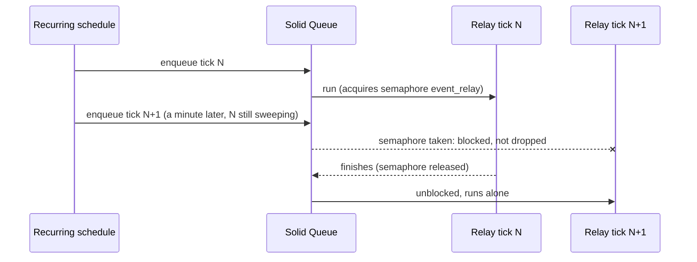

# Rails Vanilla Domain Events

Durable domain events in plain Rails, built up chapter by chapter. No event gem, no bus framework, no message broker: Active Record, a concern, Active Job, and a recurring job carry the whole thing.

This repo exists to make one argument, in the spirit of [Vanilla Rails is plenty](https://dev.37signals.com/vanilla-rails-is-plenty/): before reaching for wisper, Kafka, or an eventing framework, check what the framework you already run gives you.

A guiding principle follows from that argument: lean on Rails and Solid Queue internals as far as they go (transactions, `after_create_commit`, `retry_on`, failed executions, recurring tasks) and only write code where the framework stops. Every line added in the chapters answers a question the stack does not.

Domain: an `Order` you can place, pay, and ship. Paying records an `order.paid` event; two subscribers react (customer confirmation, inventory adjustment).

> [!WARNING]
> This is an experiment, not battle-tested production code. The mechanics are exercised by the test suites on each chapter branch, but the pattern has not carried production traffic. Read it as a reference implementation to study and adapt, not as something to vendor in as-is.

## Run it

```sh
bin/setup --skip-server
bin/rails test
bin/demo        # the guided walkthrough from chapter 1, still green
```

## How to read this repo

Reliable eventing is a chain of questions, each one only askable once the previous is answered. This repo is organized as that chain: `main` states the problem and holds the naive starting point (`Rails.event.notify`, a log line and nothing more); each chapter lives on its own branch, takes the next question, changes the code to answer it, and extends this same document. This branch is chapter 4.

Earlier chapters are not repeated here; each link below goes to that chapter's README.

1. [Did we tell the queue?](https://github.com/wcalderipe/rails-vanilla-domain-events/tree/1-did-we-tell-the-queue)
2. [Did the thing actually happen?](https://github.com/wcalderipe/rails-vanilla-domain-events/tree/2-did-the-thing-actually-happen)
3. [Which subscriber is actually done?](https://github.com/wcalderipe/rails-vanilla-domain-events/tree/3-which-subscriber-is-actually-done)
4. **Who guards the guard? (📍 you're here)**
5. [Did we say it twice?](https://github.com/wcalderipe/rails-vanilla-domain-events/tree/5-did-we-say-it-twice)
6. [In what order do facts arrive?](https://github.com/wcalderipe/rails-vanilla-domain-events/tree/6-in-what-order-do-facts-arrive)
7. [What exactly did we say?](https://github.com/wcalderipe/rails-vanilla-domain-events/tree/7-what-exactly-did-we-say)
8. [How long do we remember?](https://github.com/wcalderipe/rails-vanilla-domain-events/tree/8-how-long-do-we-remember)
9. [What breaks when we leave SQLite?](https://github.com/wcalderipe/rails-vanilla-domain-events/tree/9-what-breaks-when-we-leave-sqlite)

## Question 4: Who guards the guard?

Every guarantee so far leans on one worker: `Event::RelayJob`, sweeping every minute for lost fanouts (tier 1) and lost effects (tier 2). Chapter 4 asks what happens when the guard itself misbehaves. There are three failure modes, and the repo principle shows clearly here: two of them are answered almost entirely by machinery Solid Queue already ships.

### Overlapping ticks: the semaphore the queue already has

The recurring schedule guarantees one enqueue of the relay per minute. It does not guarantee that tick N finished before tick N+1 starts. Under a large backlog, two relays scan the same stranded events and stale deliveries, both enqueue the full fanout, and every duplicate burns a delivery's `attempts` twice as fast, corrupting the `MAX_ATTEMPTS` accounting that chapter 3 made load-bearing.

The fix is one line, because Solid Queue ships a semaphore:

```ruby
class Event::RelayJob < ApplicationJob
  limits_concurrency key: "event_relay", to: 1
end
```

Verified semantics, from the gem source (solid_queue 1.4.0): a job enqueued while another holds the semaphore is blocked, not dropped. The default `on_conflict` is `:block` (`lib/active_job/concurrency_controls.rb`), which parks the job as a `SolidQueue::BlockedExecution`. When the running relay finishes, its job row is destroyed and the destroy callback releases the semaphore and unblocks the next waiter (`app/models/solid_queue/job/concurrency_controls.rb`). If the holder crashes without finishing, the semaphore expires after the concurrency `duration` (3 minutes by default, `lib/solid_queue.rb`), and the dispatcher's maintenance loop releases expired blocked executions (`app/models/solid_queue/blocked_execution.rb`). So a crashed relay delays the next tick by at most the duration; it cannot deadlock the schedule.

One honest caveat: the `:test` adapter never touches Solid Queue's job models, so this declaration is inert in the test suite. There is no test asserting the semaphore because a test that cannot fail is worse than a documented behavior; the semantics above come from reading the gem, with file references so you can check.



### A poison item must not stop the sweep

Both sweeps used to iterate with a bare `find_each`, so one raising item aborted everything behind it in the batch, and a tier 1 explosion also starved tier 2, because `perform` runs the tiers sequentially. One poison event throttled every recovery in the system.

The fix is the repo's usual error-handling shape, applied per item: rescue, report with the item's id via `Rails.error.report`, continue the loop (`Event.relay_stranded`, `Event::Delivery.redeliver_stale`). A poison item stays exactly where it was, stranded or pending, which means it stays visible: the next tick retries it, the error reporter has its id, and the health reading below keeps pointing at it until someone acts. Nothing is skipped silently.

The integration tests drive this through a real `Event::RelayJob.perform_now` tick: a poison event in tier 1 and a poison delivery in tier 2, in the same tick, with the healthy work behind them still done and the counts reflecting only what succeeded (`test/models/event_relay_guard_test.rb`).

### When the guard itself dies

Solid Queue shows jobs that failed. It has nothing that says a recurring job never ran: if the scheduler stops, stranded events and stale deliveries accumulate with no signal anywhere. This is the one place in this chapter where the framework genuinely stops, so it is the one place that earns new code, and the code is small:

- Each tick emits a liveness signal with its counts: `Rails.event.notify("event_relay.swept", stranded:, redelivered:, failed:)`. A monitor alerts on the absence of this signal.
- Two health readings answer "how far behind is the guard?": `Event.oldest_stranded_age` and `Event::Delivery.oldest_pending_age`, the age in seconds of the oldest item still waiting. Healthy systems keep both near zero; a growing age means the guard is asleep or a poison item is stuck.

The alert rule, stated plainly: page if no `event_relay.swept` event arrives for a few minutes, or if either age exceeds a small multiple of the sweep interval. The alarm itself lives in the ops stack (log-based alerting, a metrics scraper); the repo's job is to provide the signal, and now it does.

### The limit: nothing stops the same fact from being said twice

The guard now protects delivery end to end: fanout recovered, effects recovered, the guard itself serialized, poison isolated, silence detectable. All of it assumes each fact was published once. Nothing enforces that: publishing the same fact twice creates two event rows with two ids, and a consumer that dedupes by event id applies both. Today the domain's own state records prevent it by accident. Making publication idempotent on purpose is the next question: **Did we say it twice?**
