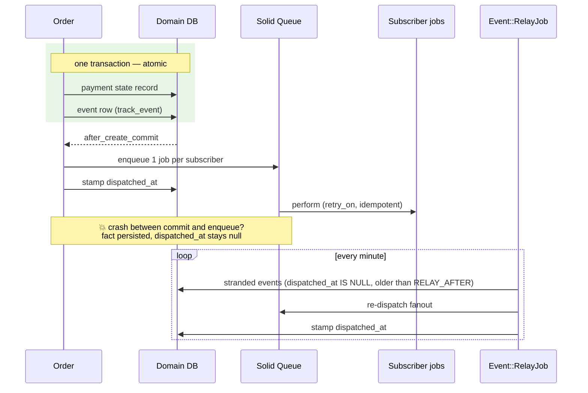

# Rails Vanilla Domain Events

Durable domain events, transactional outbox included, in **79 lines of plain Rails**. No event gem, no bus framework, no message broker: just Active Record, a concern, Active Job, and a recurring job.

This repo exists to make one argument, in the spirit of [Vanilla Rails is plenty](https://dev.37signals.com/vanilla-rails-is-plenty/): before reaching for wisper, Kafka, or an eventing framework, check what the framework you already run gives you. Events as records (the Eventable pattern), fanned out to subscriber jobs, completed with a transactional outbox so no committed fact ever goes unannounced.

Domain: an `Order` you can place, pay, and ship. Paying records an `order.paid` event; two subscribers react (customer confirmation, inventory adjustment).

## Run it

```sh
bin/setup --skip-server
bin/rails test
bin/demo        # the guided walkthrough: happy path, redelivery, crash gap, relay recovery
```

## The problem

You committed a state change and need the rest of the system to react: send the confirmation, adjust inventory, sync a third party. The naive options all lose events:

- **Inline callbacks** couple the emitter to every listener and run side effects inside the request.
- **Enqueue a job per side effect at the call site** scatters the fan-out across emitters, and a crash between the DB commit and the enqueue silently loses the reaction.
- **In-memory pub/sub** (wisper-style buses, `ActiveSupport::Notifications`) evaporates on any crash or restart: there is no record that the event ever happened.

The failure mode that matters is always the same dual write: the domain database commits, the queue never hears about it, and the missed side effect (an email never sent, access never granted) surfaces as a support ticket, not an error.

## Features

| Feature | How it is solved | Where |
|---|---|---|
| Atomic fact recording | The event row is inserted inside the domain transaction; the fact commits with the state change or not at all | `Eventable#track_event`, `app/models/concerns/eventable.rb` |
| Lost fanout is detectable | Fanout stamps `dispatched_at` after enqueueing; a crash in between leaves it null instead of leaving silence | `Event#dispatch`, `app/models/event.rb` |
| Lost fanout is recovered | A recurring relay re-dispatches undispatched events older than `RELAY_AFTER` (the Polling Publisher half of the outbox pattern) | `Event::RelayJob`, `config/recurring.yml` |
| At-least-once delivery, made safe | The relay redoes the whole fanout, so consumers are idempotent by contract; both standard shapes are demonstrated | natural key: `Order::Confirmation` (unique on `order_id`); event-id dedup: `Inventory::Adjustment` (unique on `event_id`, stock derived by sum) |
| Subscriber isolation | One job per subscriber: a failing consumer retries alone and never blocks the others | `Event#dispatch` fan-out; per-job `retry_on` |
| Decoupled emitters and listeners | A registry maps action to subscribers; events without listeners are still recorded, history does not depend on who listens | `Event.subscribe`, `config/initializers/event_subscriptions.rb` |
| Immutable history | The fact fields are `attr_readonly`; only the outbox bookkeeping (`dispatched_at`) stays writable | `app/models/event.rb` |
| Audit trail for free | The events table is readable history, ordered by emission (enabled by the design; no feed UI in this demo) | `Event` + `payload` |
| Replay and backfill | A new subscriber can be fed from the table by re-dispatching (enabled by the design; not wired in this demo) | re-dispatch over `Event` scopes |
| Deterministic crash testing | An internal seam turns off dispatch-after-create to simulate the crash between commit and fanout | `Event.dispatch_after_create`, used by tests and `bin/demo` |

## The gap the outbox closes, precisely

Recording the event and telling the world about it are two writes:

1. `track_event` inserts the `Event` row **inside the domain transaction**: the fact commits atomically with the state change it records. This part is durable by construction.
2. `after_create_commit` then enqueues one job per subscriber. This is a **dual write**: if the process dies between the commit and the enqueue (deploy restart, OOM kill, crash), the fact exists but nobody ever reacts to it.

`after_create_commit` alone cannot close that gap; it can only make it rare. Worse, without a marker the failure is **invisible**: the row looks like every other row, and the missed side effect (an email never sent, access never granted) surfaces as a support ticket, not an error.

## How the outbox closes it

Two pieces on top of the plain Eventable pattern:

- **A dispatch marker** (`events.dispatched_at`). Fanout enqueues the subscriber jobs and then stamps the marker. A crash anywhere in between leaves `dispatched_at` null, which makes the stranded event *detectable*.
- **A relay** (`Event::RelayJob`, scheduled every minute in `config/recurring.yml`). It re-dispatches any undispatched event older than `Event::RELAY_AFTER`, so no committed fact stays unannounced. This is the Message Relay / Polling Publisher half of the outbox pattern.



## The consequence: at-least-once, so consumers are idempotent

The relay re-runs the **whole** fanout (there is no per-subscriber delivery state), so a subscriber can see the same event more than once. Every consumer here is idempotent, showing the two standard shapes:

- **Natural key**: `Order::Confirmation` has a unique index on `order_id`; a replayed `order.paid` confirms nothing new.
- **Event id dedup**: `Inventory::Adjustment` has a unique index on `event_id`; the same event can never adjust stock twice. Stock is *derived* from adjustments (`Inventory.on_hand`), never counter-updated, so replays cannot drift it.

If subscribers multiply or need per-destination visibility, the next step is a delivery record per (event, subscriber): the `Webhook::Delivery` shape, which turns "redo the whole fanout" into "redo this delivery".

## Where the queue lives, and why it matters

This app uses Rails 8 defaults: Solid Queue in production with its **own** SQLite database (`queue` in `config/database.yml`), separate from the primary. Enqueue and domain commit therefore **cannot share a transaction**, which is exactly why the gap exists and the relay earns its place. Even an all-SQLite setup has the dual write.

If you point Solid Queue at the **same** database as the domain, you can enqueue *inside* the transaction and get atomicity for free: the marker + relay become unnecessary. The pattern here is for every topology where that co-location is not true (separate queue DB, Redis-backed queues, a domain DB different from the queue DB) or not stable (you might split later).

## Vanilla Rails is plenty

The whole mechanism is 79 lines, every one of them stock Rails:

| Guarantee | Stock Rails feature that provides it |
|---|---|
| Fact commits atomically with the state change | Active Record transactions (`events.create!` inside the caller's transaction) |
| Fanout after the data is visible | `after_create_commit` |
| Retries, backoff, failure visibility | Active Job + Solid Queue (`retry_on`, failed executions) |
| The relay's schedule | Solid Queue recurring tasks (`config/recurring.yml`) |
| Append-only facts | `attr_readonly` |
| Consumer idempotency | unique indexes |

There is no library to learn, no broker to operate, and nothing to upgrade. The trade this makes is explicit: at-least-once delivery with idempotent consumers, instead of the exactly-once that no broker actually gives you anyway.

## Design notes

- `Event` is append-only on the domain side: `attr_readonly` on `eventable`, `action`, `payload`. `dispatched_at` is outbox bookkeeping, not part of the fact, so it stays writable.
- The fact and the reaction are decoupled by the registry (`config/initializers/event_subscriptions.rb`): events without subscribers are still recorded; history does not depend on who listens.
- `Event.dispatch_after_create` exists as an internal seam for tests and the demo: turning it off simulates the crash between commit and fanout deterministically.
- The interface is small (`track_event`, `Event.subscribe`; the relay is invisible to callers); the outbox mechanics hide behind it. Deleting the mechanism would push dispatch bookkeeping into every emitting model, which is the deletion-test argument for keeping it a deep module.
