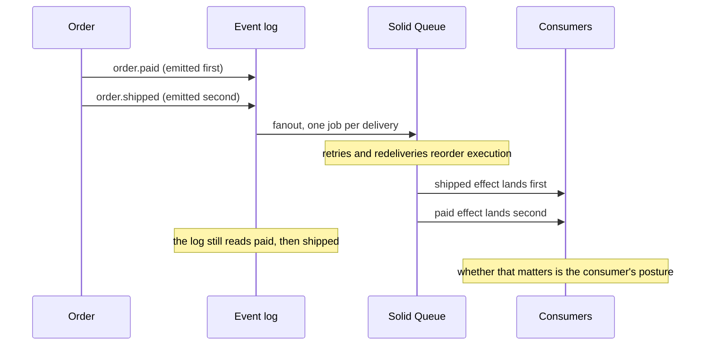

# Rails Vanilla Domain Events

Durable domain events in plain Rails, built up chapter by chapter. No event gem, no bus framework, no message broker: Active Record, a concern, Active Job, and a recurring job carry the whole thing.

This repo exists to make one argument, in the spirit of [Vanilla Rails is plenty](https://dev.37signals.com/vanilla-rails-is-plenty/): before reaching for wisper, Kafka, or an eventing framework, check what the framework you already run gives you.

A guiding principle follows from that argument: lean on Rails and Solid Queue internals as far as they go (transactions, `after_create_commit`, `retry_on`, failed executions, recurring tasks) and only write code where the framework stops. Every line added in the chapters answers a question the stack does not.

Domain: an `Order` you can place, pay, and ship. Paying records an `order.paid` event; two subscribers react (customer confirmation, inventory adjustment).

> [!WARNING]
> This is an experiment, not battle-tested production code. The mechanics are exercised by the test suites on each chapter branch, but the pattern has not carried production traffic. Read it as a reference implementation to study and adapt, not as something to vendor in as-is.

## Run it

```sh
bin/setup --skip-server
bin/rails test
bin/demo        # the guided walkthrough from chapter 1, still green
```

## How to read this repo

Reliable eventing is a chain of questions, each one only askable once the previous is answered. This repo is organized as that chain: `main` states the problem and holds the naive starting point (`Rails.event.notify`, a log line and nothing more); each chapter lives on its own branch, takes the next question, changes the code to answer it, and extends this same document. This branch is chapter 6.

Earlier chapters are not repeated here; each link below goes to that chapter's README.

1. [Did we tell the queue?](https://github.com/wcalderipe/rails-vanilla-domain-events/tree/1-did-we-tell-the-queue)
2. [Did the thing actually happen?](https://github.com/wcalderipe/rails-vanilla-domain-events/tree/2-did-the-thing-actually-happen)
3. [Which subscriber is actually done?](https://github.com/wcalderipe/rails-vanilla-domain-events/tree/3-which-subscriber-is-actually-done)
4. [Who guards the guard?](https://github.com/wcalderipe/rails-vanilla-domain-events/tree/4-who-guards-the-guard)
5. [Did we say it twice?](https://github.com/wcalderipe/rails-vanilla-domain-events/tree/5-did-we-say-it-twice)
6. **In what order do facts arrive? (📍 you're here)**
7. [What exactly did we say?](https://github.com/wcalderipe/rails-vanilla-domain-events/tree/7-what-exactly-did-we-say)
8. [How long do we remember?](https://github.com/wcalderipe/rails-vanilla-domain-events/tree/8-how-long-do-we-remember)
9. [What breaks when we leave SQLite?](https://github.com/wcalderipe/rails-vanilla-domain-events/tree/9-what-breaks-when-we-leave-sqlite)

## Question 6: In what order do facts arrive?

The honest guarantee, stated plainly: this system is **unordered at-least-once**. Chapter 5 gave each fact an identity, so saying it twice collapses into once. Nothing anywhere promises that facts take effect in the order they happened, and this chapter's answer is not to add that promise. It is to show that emission order and processing order are different things, that the consumers already in this repo never needed the promise, and that naming the posture behind that fact is enough.

This chapter adds no application code. The tests and this document are the whole change.

### Emission order and processing order are different facts

Emission order is recorded. Events are rows, and `Event.chronologically` (`app/models/event.rb`) is the log in the order the facts happened. Whatever scrambling happens downstream, the log still knows the truth; a test pins exactly that.

Processing order is not guaranteed, for three causes that already live in this repo:

- Parallel workers: `config/queue.yml` runs three worker threads; two effects execute concurrently and finish in either order.
- Retry backoff (chapter 2): a failed effect re-enqueues behind jobs that were emitted after it.
- Tier-2 redelivery (chapter 3): a delivery redriven minutes later lands long after its neighbors.

So `order.shipped`'s effect can land before `order.paid`'s even though it was emitted after. No engine setting changes this; it is the nature of effects running as independent jobs.



### The three consumer postures

The tests (`test/models/event_ordering_test.rb`) apply effects in the opposite of emission order and let each posture speak:

1. One-shot by natural key. `Order::Confirmation` records once per order, whenever its event lands. Order is irrelevant by construction.
2. Commutative and derived. `Inventory.on_hand` is a sum over adjustments, so any permutation of arrivals converges to the same stock. Chapter 1's rule, stock is derived and never counter-updated, was quietly answering this question all along.
3. Precondition-gated via retry. A consumer that genuinely needs an earlier fact checks the precondition and raises when it is missing. Chapter 2's `retry_on` becomes the reordering mechanism: the effect re-enqueues behind the fact it was waiting for and converges on the next attempt. Ordering by backoff, with zero new machinery.

The documentation test shows the fourth shape, the one to avoid: a last-write-wins projection that trusts arrival order records `paid` as the final status of an order that shipped. The test asserts the wrong state on purpose and stays green as a warning: protection is consumer posture, not the mechanism. If a projection must reflect the latest fact, it has the log's emission order to compare against instead of trusting arrival.

### What SQLite is quietly protecting

Emission order deserves one honest footnote. It is total and gapless today because SQLite allows one writer at a time, in any journal mode. WAL changes reader concurrency, not writer concurrency: the write lock is held to commit, across every process touching the file. One write transaction at a time means row ids follow commit order and an id never becomes visible while a smaller one is still uncommitted.

That protection lives in the domain database, not in Solid Queue. Moving the queue to another store changes nothing here; moving the domain database to Postgres removes it entirely, because concurrent writers interleave commits and leave id gaps. The typical migration moves both to the same Postgres in one step, so the protection tends to disappear exactly when everything else changes too. That cliff belongs to question 9. This chapter's subject, processing order, was never protected by any engine.

### Out of scope, on purpose

No sequence numbers, no per-stream position column, no advisory locks, no consumer cursors. Guaranteed per-aggregate ordering is a per-stream serialization problem, and on SQLite the single writer already serializes appends, so the machinery would be redundant the day it was written and would need a redesign the day the database moves. Question 9 owns that design. Until a consumer exists that cannot be written in one of the three postures, ordering machinery is speculation.

### The limit: the shape of what was said

Consumers now tolerate when facts arrive. What they cannot yet trust is what the facts say: every consumer reaches into `event.payload` for keys and types nobody promised. The payload is an implicit contract with no owner, and that is the next question: **What exactly did we say?**
