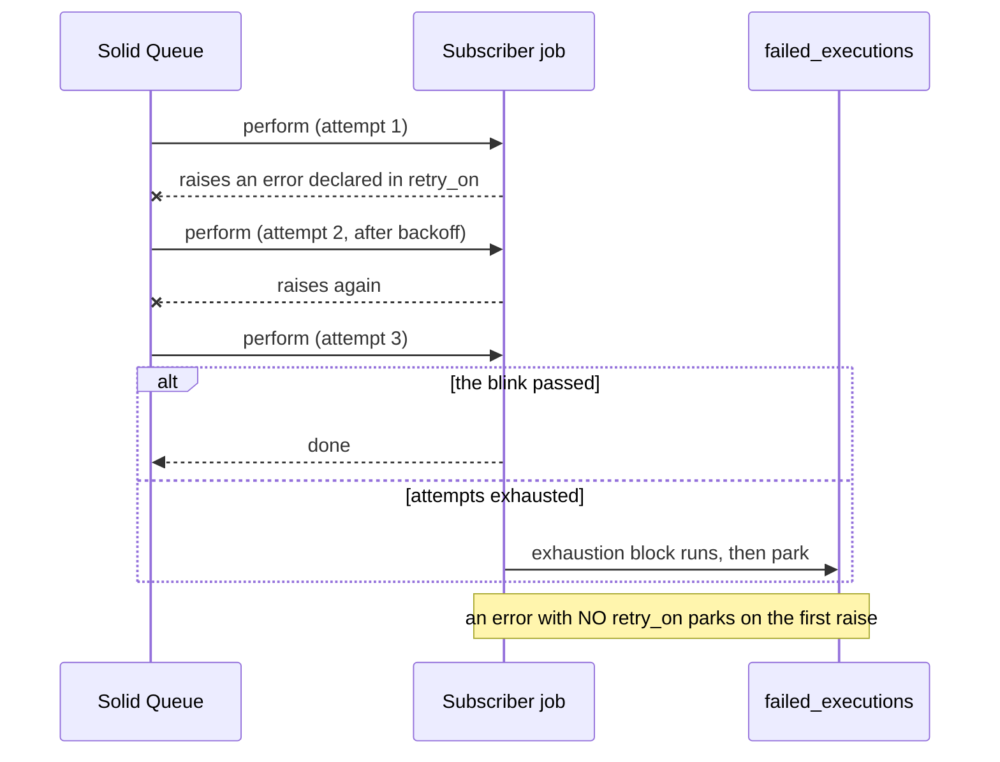

# Rails Vanilla Domain Events

Durable domain events in plain Rails, built up chapter by chapter. No event gem, no bus framework, no message broker: Active Record, a concern, Active Job, and a recurring job carry the whole thing.

This repo exists to make one argument, in the spirit of [Vanilla Rails is plenty](https://dev.37signals.com/vanilla-rails-is-plenty/): before reaching for wisper, Kafka, or an eventing framework, check what the framework you already run gives you.

A guiding principle follows from that argument: lean on Rails and Solid Queue internals as far as they go (transactions, `after_create_commit`, `retry_on`, failed executions, recurring tasks) and only write code where the framework stops. Every line added in the chapters answers a question the stack does not.

Domain: an `Order` you can place, pay, and ship. Paying records an `order.paid` event; two subscribers react (customer confirmation, inventory adjustment).

> [!WARNING]
> This is an experiment, not battle-tested production code. The mechanics are exercised by the test suites on each chapter branch, but the pattern has not carried production traffic. Read it as a reference implementation to study and adapt, not as something to vendor in as-is.

## Run it

```sh
bin/setup --skip-server
bin/rails test
bin/demo        # the guided walkthrough from chapter 1
```

## How to read this repo

Reliable eventing is a chain of questions, each one only askable once the previous is answered. This repo is organized as that chain: `main` states the problem and holds the naive starting point (`Rails.event.notify`, a log line and nothing more); each chapter lives on its own branch, takes the next question, changes the code to answer it, and extends this same document. This branch is chapter 2.

Earlier chapters are not repeated here; each link below goes to that chapter's README.

1. [Did we tell the queue?](https://github.com/wcalderipe/rails-vanilla-domain-events/tree/1-did-we-tell-the-queue)
2. **Did the thing actually happen? (📍 you're here)**
3. [Which subscriber is actually done?](https://github.com/wcalderipe/rails-vanilla-domain-events/tree/3-which-subscriber-is-actually-done)
4. [Who guards the guard?](https://github.com/wcalderipe/rails-vanilla-domain-events/tree/4-who-guards-the-guard)
5. [Did we say it twice?](https://github.com/wcalderipe/rails-vanilla-domain-events/tree/5-did-we-say-it-twice)
6. [In what order do facts arrive?](https://github.com/wcalderipe/rails-vanilla-domain-events/tree/6-in-what-order-do-facts-arrive)
7. [What exactly did we say?](https://github.com/wcalderipe/rails-vanilla-domain-events/tree/7-what-exactly-did-we-say)
8. [How long do we remember?](https://github.com/wcalderipe/rails-vanilla-domain-events/tree/8-how-long-do-we-remember)
9. [What breaks when we leave SQLite?](https://github.com/wcalderipe/rails-vanilla-domain-events/tree/9-what-breaks-when-we-leave-sqlite)

## Question 2: Did the thing actually happen?

Chapter 1 guarantees the announcement: every subscriber job reaches the queue at least once. This chapter is about what happens after, when a subscriber job runs and raises.

### What Solid Queue gives you before you write a line

An unhandled exception does not retry. The job is parked as a failed execution (`solid_queue_failed_executions`) with its error and backtrace, waiting for a human to retry or discard it. That is real visibility for free: nothing is swallowed, every failure has a row. But parked is not cured. Nobody reacts until someone looks.

### retry_on is the cure, and it is opt-in

```ruby
class ApplicationJob < ActiveJob::Base
  retry_on ActiveRecord::Deadlocked
  discard_on ActiveJob::DeserializationError
end
```

Every generated Rails app ships these two lines commented out; enabling them is most of this chapter. `retry_on` re-enqueues with backoff for the errors you declare transient. `discard_on` drops a job that retrying can never fix: subscriber jobs carry a reference to the event row, and a job whose row is gone would otherwise fail forever.

A rule this repo takes a position on: the transient list belongs to each subscriber, not to a shared generic job. Each consumer knows which of its dependencies blink. The base class carries only what is transient for everyone (deadlocks) and the one discard that protects every event-carrying job. Piling every subscriber's error classes onto one generic broadcast job couples consumers that have nothing to do with each other; that smell is half the reason chapter 1 fans out one job per subscriber.

### Exhaustion is a state, not an exception

Without a block, `retry_on` re-raises after the last attempt and the job parks. With a block, exhaustion becomes an explicit terminal transition: report it, mark something, page someone.

```ruby
retry_on TransientError, wait: :polynomially_longer, attempts: 3 do |job, error|
  Rails.error.report(error, context: { job: job.class.name })
end
```



The tests pin the whole ladder (`test/jobs/subscriber_retry_test.rb`): a declared transient failure is re-enqueued instead of raising; retried to success when the blink passes; bounded and landed in the terminal handler when it does not. An undeclared error executes once and parks. A deleted event row discards instead of looping.

### The limit: the outbox still believes everything worked

Nothing in this chapter changes what the outbox knows. `dispatched_at` was stamped at enqueue time; retries, exhaustion, and discards all happen after that, invisible to the relay. A subscriber that exhausts its retries parks in Solid Queue while the event stands dispatched. Counting effects instead of enqueues is the next question: **Which subscriber is actually done?**
