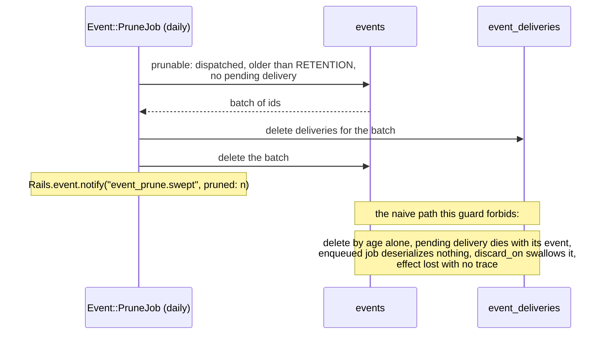

# Rails Vanilla Domain Events

Durable domain events in plain Rails, built up chapter by chapter. No event gem, no bus framework, no message broker: Active Record, a concern, Active Job, and a recurring job carry the whole thing.

This repo exists to make one argument, in the spirit of [Vanilla Rails is plenty](https://dev.37signals.com/vanilla-rails-is-plenty/): before reaching for wisper, Kafka, or an eventing framework, check what the framework you already run gives you.

A guiding principle follows from that argument: lean on Rails and Solid Queue internals as far as they go (transactions, `after_create_commit`, `retry_on`, failed executions, recurring tasks) and only write code where the framework stops. Every line added in the chapters answers a question the stack does not.

Domain: an `Order` you can place, pay, and ship. Paying records an `order.paid` event; two subscribers react (customer confirmation, inventory adjustment).

> [!WARNING]
> This is an experiment, not battle-tested production code. The mechanics are exercised by the test suites on each chapter branch, but the pattern has not carried production traffic. Read it as a reference implementation to study and adapt, not as something to vendor in as-is.

## Run it

```sh
bin/setup --skip-server
bin/rails test
bin/demo        # the guided walkthrough from chapter 1, still green
```

## How to read this repo

Reliable eventing is a chain of questions, each one only askable once the previous is answered. This repo is organized as that chain: `main` states the problem and holds the naive starting point (`Rails.event.notify`, a log line and nothing more); each chapter lives on its own branch, takes the next question, changes the code to answer it, and extends this same document. This branch is chapter 8.

Earlier chapters are not repeated here; each link below goes to that chapter's README.

1. [Did we tell the queue?](https://github.com/wcalderipe/rails-vanilla-domain-events/tree/1-did-we-tell-the-queue)
2. [Did the thing actually happen?](https://github.com/wcalderipe/rails-vanilla-domain-events/tree/2-did-the-thing-actually-happen)
3. [Which subscriber is actually done?](https://github.com/wcalderipe/rails-vanilla-domain-events/tree/3-which-subscriber-is-actually-done)
4. [Who guards the guard?](https://github.com/wcalderipe/rails-vanilla-domain-events/tree/4-who-guards-the-guard)
5. [Did we say it twice?](https://github.com/wcalderipe/rails-vanilla-domain-events/tree/5-did-we-say-it-twice)
6. [In what order do facts arrive?](https://github.com/wcalderipe/rails-vanilla-domain-events/tree/6-in-what-order-do-facts-arrive)
7. [What exactly did we say?](https://github.com/wcalderipe/rails-vanilla-domain-events/tree/7-what-exactly-did-we-say)
8. **How long do we remember? (📍 you're here)**
9. [What breaks when we leave SQLite?](https://github.com/wcalderipe/rails-vanilla-domain-events/tree/9-what-breaks-when-we-leave-sqlite)

## Question 8: How long do we remember?

Every chapter so far adds rows and none removes any. Events accumulate forever, and they are not neutral bytes: the `order.paid` payload carries `customer_email`, literally personal data aging into liability. Chapter 1 sold the events table as an audit trail for free; retention is the price tag. The log is an audit trail until the window closes, and where that window sits is a business decision (audit obligations pull it longer, privacy pulls it shorter). The mechanism here only enforces whatever the business decided; `Event::RETENTION` is that decision as a constant.

### Why naive pruning is dangerous

Deleting old rows looks harmless, and it is not, because of an interaction bought in chapter 2. Subscriber jobs carry their delivery by reference (GlobalID). Delete an event whose job has not run yet, and the delivery goes with it (`dependent: :destroy`), the job deserializes nothing, and `discard_on ActiveJob::DeserializationError` swallows the error, which is exactly what it is for. The effect is dropped with no trace: no confirmation, no failed delivery, nothing terminal for a human to find. The first commit on this branch is a test pinning that silent drop; it stays green as permanent documentation of why the guard below exists.

### The guard: old enough AND owing nothing

```ruby
scope :prunable, -> {
  dispatched
    .where(created_at: ..RETENTION.ago)
    .where.not(id: Event::Delivery.pending.select(:event_id))
}
```

Three conditions, each earning its place. Dispatched: an undispatched event still owes its whole fanout, however old, and tier 1 of the relay may yet recover it. Older than the window: youth alone protects the rest. No pending delivery: a pending delivery is work the relay may still re-drive, and deleting the event under it is the silent drop above. Terminal deliveries and zero-subscriber events are memory, not work, so age alone decides for them.



`Event.prune` deletes in batches, deliveries first because the foreign key demands it, with `delete_all` on purpose: neither model has destroy callbacks, so instantiating ninety days of rows to fire no-op callbacks would be ceremony. The `dependent: :destroy` on the association stays for one-off console destroys. The daily `Event::PruneJob` reports `event_prune.swept` with the pruned count, the same liveness-signal shape the relay uses: a monitor alerts when the signal goes quiet.

What stays out: archival. Moving old events to cold storage instead of deleting them is a legitimate option this chapter acknowledges in one line and does not build.

### The limit: what breaks when we leave SQLite?

Retention closes the lifecycle: facts are born atomically, announced at least once, acted on exactly once per subscriber or terminally failed, and now forgotten on schedule. Everything above holds on the engine this app runs. The last question is which of those guarantees were properties of the design and which were properties of SQLite: **What breaks when we leave SQLite?**
