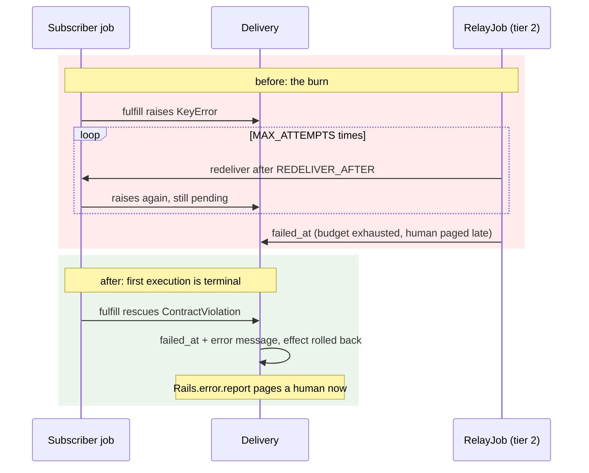

# Rails Vanilla Domain Events

Durable domain events in plain Rails, built up chapter by chapter. No event gem, no bus framework, no message broker: Active Record, a concern, Active Job, and a recurring job carry the whole thing.

This repo exists to make one argument, in the spirit of [Vanilla Rails is plenty](https://dev.37signals.com/vanilla-rails-is-plenty/): before reaching for wisper, Kafka, or an eventing framework, check what the framework you already run gives you.

A guiding principle follows from that argument: lean on Rails and Solid Queue internals as far as they go (transactions, `after_create_commit`, `retry_on`, failed executions, recurring tasks) and only write code where the framework stops. Every line added in the chapters answers a question the stack does not.

Domain: an `Order` you can place, pay, and ship. Paying records an `order.paid` event; two subscribers react (customer confirmation, inventory adjustment).

> [!WARNING]
> This is an experiment, not battle-tested production code. The mechanics are exercised by the test suites on each chapter branch, but the pattern has not carried production traffic. Read it as a reference implementation to study and adapt, not as something to vendor in as-is.

## Run it

```sh
bin/setup --skip-server
bin/rails test
bin/demo        # the guided walkthrough from chapter 1, still green
```

## How to read this repo

Reliable eventing is a chain of questions, each one only askable once the previous is answered. This repo is organized as that chain: `main` states the problem and holds the naive starting point (`Rails.event.notify`, a log line and nothing more); each chapter lives on its own branch, takes the next question, changes the code to answer it, and extends this same document. This branch is chapter 7.

Earlier chapters are not repeated here; each link below goes to that chapter's README.

1. [Did we tell the queue?](https://github.com/wcalderipe/rails-vanilla-domain-events/tree/1-did-we-tell-the-queue)
2. [Did the thing actually happen?](https://github.com/wcalderipe/rails-vanilla-domain-events/tree/2-did-the-thing-actually-happen)
3. [Which subscriber is actually done?](https://github.com/wcalderipe/rails-vanilla-domain-events/tree/3-which-subscriber-is-actually-done)
4. [Who guards the guard?](https://github.com/wcalderipe/rails-vanilla-domain-events/tree/4-who-guards-the-guard)
5. [Did we say it twice?](https://github.com/wcalderipe/rails-vanilla-domain-events/tree/5-did-we-say-it-twice)
6. [In what order do facts arrive?](https://github.com/wcalderipe/rails-vanilla-domain-events/tree/6-in-what-order-do-facts-arrive)
7. **What exactly did we say? (📍 you're here)**
8. [How long do we remember?](https://github.com/wcalderipe/rails-vanilla-domain-events/tree/8-how-long-do-we-remember)
9. [What breaks when we leave SQLite?](https://github.com/wcalderipe/rails-vanilla-domain-events/tree/9-what-breaks-when-we-leave-sqlite)

## Question 7: What exactly did we say?

Every chapter so far moves facts around without reading them. The consumers do read them: `Inventory::Adjustment.apply` reaches into `event.payload` for `"item"` and `"quantity"` and trusts both to exist and to make sense. Nobody promised that. The payload is a contract with no owner, and the machinery built in chapters 2 and 3 makes breaking it expensive in a specific, measurable way.

### The burn

Publish an `order.paid` whose payload is missing `quantity` and watch the layers do exactly what they were built to do. The consumer raises `KeyError`. The error is not declared transient, so the job parks. The delivery stays pending, so tier 2 redelivers after `REDELIVER_AFTER`. The payload is still malformed, so it parks again. Only after `MAX_ATTEMPTS` redeliveries does the delivery land in `failed` and page a human: the whole redelivery budget spent retrying something that could never succeed. The first commit on this branch is a test pinning that waste (`d487f30`); the fix flips it.

A contract violation is not a blink. Chapter 2 sorted errors into transient (retry) and unexpected (park, visible); this chapter adds the third kind: never retryable, and the sooner it fails terminally, the sooner someone fixes the emitter.



### Who owns what

The rules are documentation plus one error class, not machinery:

- The emitter owns the schema. What `order.paid` says is `Order#pay`'s decision, and the schema's source of truth is the emitter's own tests: `test/models/order/contract_test.rb` pins each action's payload shape, so renaming or removing a key breaks the build on the emitter's side instead of production on the consumer's side.
- The consumer owns its requirements. `Inventory::Adjustment` declares what it needs at the fetch site: `required(event, "item")`, a quantity that is a positive integer. A missing or malformed value raises `Event::ContractViolation` with a message that names the action and the key.
- Consumers are tolerant readers. Unknown keys never break anyone (pinned by test), which is what makes evolution additive: add keys freely; to rename or remove one, migrate the consumers first and let the emitter's contract test force the conversation.

### The mechanism: one rescue in fulfill

`Event::Delivery#fulfill` treats the violation as the terminal state it is:

```ruby
rescue Event::ContractViolation => violation
  mark_failed(error: violation.message)
end
```

First execution, delivery `failed`, `Rails.error.report` fires through the existing `mark_failed` path, zero redeliveries spent. One subtlety is load-bearing: the raise crosses the effect transaction's boundary, so any partial write the consumer made rolls back, and the failed stamp then commits in its own transaction. The tests pin both halves (rolled-back effect, persisted stamp), plus the healthy sibling subscriber delivering untouched, and the contrast case: an unexpected `RuntimeError` still propagates and stays pending, because an unexpected error might genuinely be a blink and tier 2 exists for exactly that.

### Why no schema gem

A JSON Schema (or a registry table) would declare the same requirements in a second language, add a dependency, and still need the consumer to decide what happens on violation, which is the only part that was ever hard. Explicit fetches say what is required, the error class says what happens when it is not, and the emitter's tests say what is sent. Every piece is plain Ruby a reader already knows how to inspect.

### The limit: how long do we remember?

Facts now have identity, order posture, and a contract. They also accumulate forever: every event, every delivery, every effect row, growing without bound, and the jobs in flight hold references into those tables. Deciding how long the log lives, and what pruning it can break, is the next question: **How long do we remember?**
