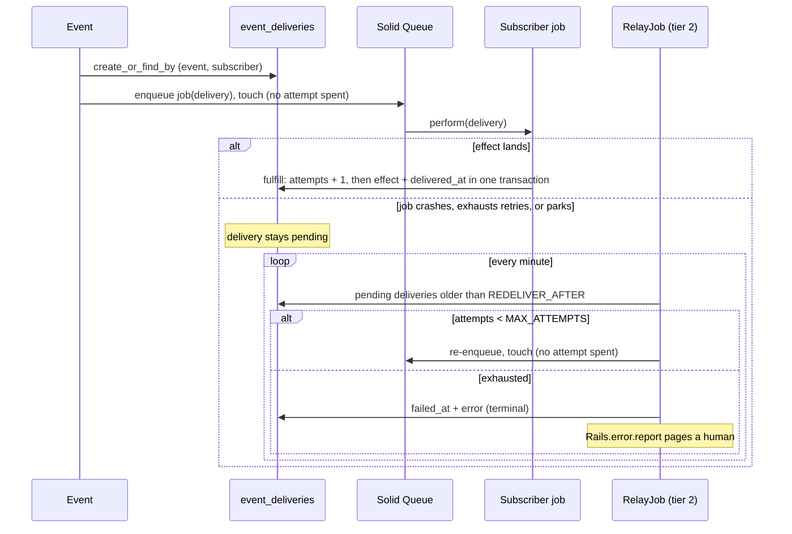

# Rails Vanilla Domain Events

Durable domain events in plain Rails, built up chapter by chapter. No event gem, no bus framework, no message broker: Active Record, a concern, Active Job, and a recurring job carry the whole thing.

This repo exists to make one argument, in the spirit of [Vanilla Rails is plenty](https://dev.37signals.com/vanilla-rails-is-plenty/): before reaching for wisper, Kafka, or an eventing framework, check what the framework you already run gives you.

A guiding principle follows from that argument: lean on Rails and Solid Queue internals as far as they go (transactions, `after_create_commit`, `retry_on`, failed executions, recurring tasks) and only write code where the framework stops. Every line added in the chapters answers a question the stack does not.

Domain: an `Order` you can place, pay, and ship. Paying records an `order.paid` event; two subscribers react (customer confirmation, inventory adjustment).

> [!WARNING]
> This is an experiment, not battle-tested production code. The mechanics are exercised by the test suites on each chapter branch, but the pattern has not carried production traffic. Read it as a reference implementation to study and adapt, not as something to vendor in as-is.

## Run it

```sh
bin/setup --skip-server
bin/rails test
bin/demo        # the guided walkthrough from chapter 1, still green with deliveries underneath
```

## How to read this repo

Reliable eventing is a chain of questions, each one only askable once the previous is answered. This repo is organized as that chain: `main` states the problem and holds the naive starting point (`Rails.event.notify`, a log line and nothing more); each chapter lives on its own branch, takes the next question, changes the code to answer it, and extends this same document. This branch is chapter 3.

Earlier chapters are not repeated here; each link below goes to that chapter's README.

1. [Did we tell the queue?](https://github.com/wcalderipe/rails-vanilla-domain-events/tree/1-did-we-tell-the-queue)
2. [Did the thing actually happen?](https://github.com/wcalderipe/rails-vanilla-domain-events/tree/2-did-the-thing-actually-happen)
3. **Which subscriber is actually done? (📍 you're here)**
4. [Who guards the guard?](https://github.com/wcalderipe/rails-vanilla-domain-events/tree/4-who-guards-the-guard)
5. [Did we say it twice?](https://github.com/wcalderipe/rails-vanilla-domain-events/tree/5-did-we-say-it-twice)
6. [In what order do facts arrive?](https://github.com/wcalderipe/rails-vanilla-domain-events/tree/6-in-what-order-do-facts-arrive)
7. [What exactly did we say?](https://github.com/wcalderipe/rails-vanilla-domain-events/tree/7-what-exactly-did-we-say)
8. [How long do we remember?](https://github.com/wcalderipe/rails-vanilla-domain-events/tree/8-how-long-do-we-remember)
9. [What breaks when we leave SQLite?](https://github.com/wcalderipe/rails-vanilla-domain-events/tree/9-what-breaks-when-we-leave-sqlite)

## Question 3: Which subscriber is actually done?

Chapter 1 ends with `dispatched_at` stamped once every subscriber job reaches the queue. Chapter 2 makes a failing job retry. Neither changes a structural fact: **the outbox records that jobs were enqueued, not that effects happened.** A subscriber that exhausts its retries, or parks on an undeclared error, sits in Solid Queue's failed executions while the event stands dispatched. The effect (the confirmation email, the stock adjustment) is lost with no automatic recovery, which is exactly the failure class chapter 1 set out to eliminate, reintroduced one layer down.

The answer is to give each subscriber its own record of done.

### The delivery record

One row per (event, subscriber), created at dispatch, unique by construction:

```ruby
create_table :event_deliveries do |t|
  t.references :event, null: false, foreign_key: true, index: false
  t.string :subscriber, null: false
  t.integer :attempts, null: false, default: 0
  t.datetime :delivered_at
  t.datetime :failed_at
  t.string :error
  t.timestamps
  t.index [ :event_id, :subscriber ], unique: true
end
```

States are timestamps, the same shape the `Event` uses: pending (neither stamp), delivered, or failed. `dispatched_at` on the event changes meaning: it now says "delivery rows exist and the initial enqueue was attempted". Whether each effect landed is each delivery's own record.

Dispatch upserts with `create_or_find_by!` (insert first, resolved by the unique index) so a relay re-run never duplicates a delivery. Subscriber jobs now receive the delivery instead of the bare event, and wrap their effect in `fulfill`:

```ruby
def perform(delivery)
  delivery.fulfill { |event| Order::Confirmation.record(event) }
end
```

`fulfill` is the seam that makes the acknowledgment trustworthy: the effect and the `delivered_at` stamp commit in one transaction. A crash after the effect but before the ack causes a redelivery, and the terminal guard (`return if terminal?`) or the consumer's own idempotency absorbs it. Consumer models did not change at all.

### The relay grows a second tier

```ruby
def perform
  Event.relay_stranded            # tier 1: lost fanout
  Event::Delivery.redeliver_stale # tier 2: lost effect
end
```

Both tiers are required, and the reason is subtle enough to state: delivery rows are born in dispatch, which runs after commit. A crash in the chapter 1 gap leaves **zero** delivery rows, so a relay that scanned only deliveries would never see that event. Tier 1 keeps recovering the lost fanout (and now creates the missing delivery rows); tier 2 re-drives deliveries that are still pending past `REDELIVER_AFTER`.

Redelivery is bounded. `MAX_ATTEMPTS` exhausted moves the delivery to `failed`, a terminal state that reports through `Rails.error.report` instead of looping against a broken subscriber forever. Failed is alert-driven, by design: a permanently broken consumer is a human's problem, and now it has a row saying so.



### The budget counts executions, not enqueues

`attempts` is the retry budget, and `MAX_ATTEMPTS` turns it into a terminal `failed`. So the one thing it must count is real *executions*. The first cut of this chapter bumped it on every *enqueue* — and that quietly reintroduced the loss this whole repo is about. A queue outage or an overlapping relay re-enqueues a delivery that never runs; each re-enqueue spent an attempt; after five the relay marked a delivery permanently `failed` whose effect had not happened even once. The budget meant to bound retries was burning down against work that never got a turn.

So the accounting moved to where the truth is. `fulfill` increments `attempts` when the job actually runs — outside the effect's transaction, so a subscriber that runs and *fails* still spends its attempt, but a job that never runs spends nothing. `deliver_later` only enqueues; it never touches the budget. A worker outage can now re-enqueue forever without falsely failing anything; the backlog shows up in `oldest_pending_age`, not in a pile of false terminals.

Two smaller corrections travel with it:

- **`deliver_later` touches `updated_at` after a successful enqueue.** Without it, tier 1 (which re-enqueues a stranded event's deliveries) and tier 2 (which re-drives stale deliveries) would both fire on the same delivery in one tick, because `increment!` on its own updates the counter *without* touching the timestamp. The touch refreshes the staleness clock, so once tier 1 has re-driven a delivery, tier 2 — running next in the same tick — no longer sees it as stale.
- **`REDELIVER_AFTER` sits above the subscribers' `retry_on` backoff window** (15 minutes vs. a few). Tier 2 is a net for *lost* jobs, not a competitor to a subscriber that is still legitimately backing off: while `retry_on` is working, each execution refreshes `updated_at`, so the delivery never looks stale and the two mechanisms stay out of each other's way.

And the terminal transition is guarded: `mark_failed` re-checks under a row lock and refuses to stamp `failed_at` on a delivery a subscriber just delivered concurrently — otherwise a tier-2 exhaustion racing a successful effect would leave a row carrying both timestamps, paging a human for work that landed. Pinned in `test/models/event/delivery_accounting_test.rb` and `test/jobs/relay_tiers_test.rb`.

### What the guarantee is now

Chapter 1 gave at-least-once **enqueue**. This chapter upgrades it to at-least-once **effect**: every committed event either has all its deliveries `delivered`, or has a `failed` row with an error that someone was paged about. Nothing terminal happens silently.

The price does not change: delivery is still at-least-once, so consumers stay idempotent. The tests pin it (`test/models/event/delivery_test.rb`): fulfill acks atomically and no-ops on terminal deliveries; a failing effect leaves the delivery pending; stale deliveries are redelivered; exhaustion lands in `failed`; and one subscriber failing never hides that the other finished, which is the per-subscriber visibility this question asked for.

### The limit: who guards the guard?

The relay now carries two sweeps and more responsibility, with no protection of its own. Overlapping runs duplicate fanout under backlog, one poison event can abort a whole tick, and if the relay itself stops running, nothing notices. Watching the watchdog is the next question: **Who guards the guard?**
