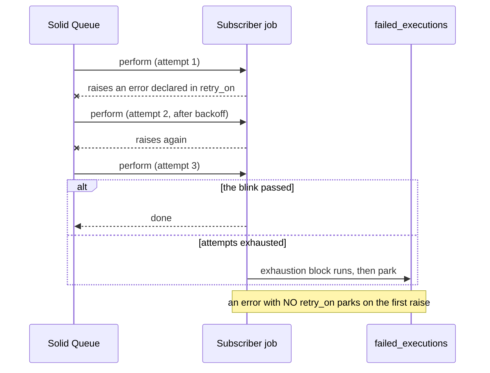

# Rails Vanilla Domain Events

Durable domain events in plain Rails, built up chapter by chapter. No event gem, no bus framework, no message broker: Active Record, a concern, Active Job, and a recurring job carry the whole thing.

This repo exists to make one argument, in the spirit of [Vanilla Rails is plenty](https://dev.37signals.com/vanilla-rails-is-plenty/): before reaching for wisper, Kafka, or an eventing framework, check what the framework you already run gives you.

A guiding principle follows from that argument: lean on Rails and Solid Queue internals as far as they go (transactions, `after_create_commit`, `retry_on`, failed executions, recurring tasks) and only write code where the framework stops. Every line added in the chapters answers a question the stack does not.

Domain: an `Order` you can place, pay, and ship. Paying records an `order.paid` event; two subscribers react (customer confirmation, inventory adjustment).

> [!WARNING]
> This is an experiment, not battle-tested production code. The mechanics are exercised by the test suites on each chapter branch, but the pattern has not carried production traffic. Read it as a reference implementation to study and adapt, not as something to vendor in as-is.

## Run it

```sh
bin/setup --skip-server
bin/rails test
bin/demo        # the guided walkthrough from chapter 1
```

## How to read this repo

Reliable eventing is a chain of questions, each one only askable once the previous is answered. This repo is organized as that chain: `main` states the problem and holds the naive starting point (`Rails.event.notify`, a log line and nothing more); each chapter lives on its own branch, takes the next question, changes the code to answer it, and extends this same document. This branch is chapter 2.

Earlier chapters are not repeated here; each link below goes to that chapter's README.

1. [Did we tell the queue?](https://github.com/wcalderipe/rails-vanilla-domain-events/tree/1-did-we-tell-the-queue)
2. **Did the thing actually happen? (📍 you're here)**
3. [Which subscriber is actually done?](https://github.com/wcalderipe/rails-vanilla-domain-events/tree/3-which-subscriber-is-actually-done)
4. [Who guards the guard?](https://github.com/wcalderipe/rails-vanilla-domain-events/tree/4-who-guards-the-guard)
5. [Did we say it twice?](https://github.com/wcalderipe/rails-vanilla-domain-events/tree/5-did-we-say-it-twice)
6. [In what order do facts arrive?](https://github.com/wcalderipe/rails-vanilla-domain-events/tree/6-in-what-order-do-facts-arrive)
7. [What exactly did we say?](https://github.com/wcalderipe/rails-vanilla-domain-events/tree/7-what-exactly-did-we-say)
8. [How long do we remember?](https://github.com/wcalderipe/rails-vanilla-domain-events/tree/8-how-long-do-we-remember)
9. [What breaks when we leave SQLite?](https://github.com/wcalderipe/rails-vanilla-domain-events/tree/9-what-breaks-when-we-leave-sqlite)

## Question 2: Did the thing actually happen?

Chapter 1 guarantees the announcement: every subscriber job reaches the queue at least once. This chapter is about what happens after, when a subscriber job runs and raises.

### What Solid Queue gives you before you write a line

An unhandled exception does not retry. The job is parked as a failed execution (`solid_queue_failed_executions`) with its error and backtrace, waiting for a human to retry or discard it. That is real visibility for free: nothing is swallowed, every failure has a row. But parked is not cured. Nobody reacts until someone looks.

### retry_on is the cure, and it is opt-in

```ruby
class ApplicationJob < ActiveJob::Base
  retry_on ActiveRecord::Deadlocked
  discard_on ActiveJob::DeserializationError
end
```

Every generated Rails app ships these two lines commented out; enabling them is most of this chapter. `retry_on` re-enqueues with backoff for the errors you declare transient. `discard_on` drops a job that retrying can never fix: subscriber jobs carry a reference to the event row, and a job whose row is gone would otherwise fail forever.

A rule this repo takes a position on: the transient list belongs to each subscriber, not to a shared generic job. Each consumer knows which of its dependencies blink. The base class carries only what is transient for everyone (deadlocks) and the one discard that protects every event-carrying job. Piling every subscriber's error classes onto one generic broadcast job couples consumers that have nothing to do with each other; that smell is half the reason chapter 1 fans out one job per subscriber.

### The rule, made real: the confirmation owns its transient

A rule with no subscriber that exercises it is decoration. `Order::ConfirmationJob` is the one with an external dependency that actually blinks: it delivers a confirmation email, and a mail server can be briefly busy or slow. So it, not the base class, declares that transient:

```ruby
class Order::ConfirmationJob < ApplicationJob
  retry_on Net::SMTPServerBusy, Timeout::Error, wait: :polynomially_longer, attempts: 5
  def perform(event) = Order::Confirmation.record(event)
end
```

`Inventory::AdjustmentJob` declares nothing beyond the base: its only dependency is the local database, whose one transient (deadlock) is already covered for everyone. That asymmetry *is* the rule: the transient list is a property of the dependency, so a subscriber that touches nothing flaky has an empty one.

Sending mail forces a decision the pure-database effects never did: the send is external IO with no transaction and no natural idempotency. `Order::Confirmation.record` handles it by making the record and the send one unit. The email goes out only on the first successful `create!`, so a relay redelivery of the same event never re-mails, and a transient mail failure rolls the row back with it so `retry_on` re-runs the whole unit cleanly. The honest cost, spelled out in the code comment: the email is **at-least-once, not exactly-once** (a commit failure right after a successful send re-mails on retry), and `deliver_now` holds a DB transaction open across the send. That is the boundary where a production system would give the email its own outbox; here it is the smallest change that makes the chapter's rule true against a real subscriber. Driven end to end (real job, a mail server that fails twice then delivers) in `test/jobs/confirmation_delivery_retry_test.rb`.

### deliver_now, deliver_later, or its own outbox

The send is the one effect with no transaction and no natural idempotency, so how it attaches to the commit is a real choice, and it has three answers. They are not interchangeable: each one moves the failure somewhere different, and only two of the three keep the posture the rest of this repo holds. Naming all three is worth the detour, because "just make it `deliver_later`" is the obvious next thought and it is a trap here.

**`deliver_now`, what this chapter ships.** The send sits inside the record's transaction, so the two commit or roll back together. A replay finds the `order_id` row already there and no-ops before it reaches the mailer, so redelivery never re-mails. A transient mail failure rolls the row back with it, and `retry_on` re-runs the whole unit. The failure it leaves is a *duplicate*: `deliver_now` succeeds, the commit right after it fails, the retry sends a second mail. The cost it carries is the write lock, held across the SMTP round trip, which on SQLite is the only writer the whole database has (chapter 9 returns to what that lock was quietly buying).

**`deliver_later`, the tempting swap.** The motive is right: get the SMTP call out from under the transaction and off the write lock. But the queue is a separate database (chapter 1's queue topology), so the enqueue cannot join the domain transaction. It is a dual write, the exact gap chapter 1 built the outbox to close, reintroduced for the email, and the event outbox does not cover it: the relay recovers event fanout, not a mailer job a subscriber failed to enqueue. What breaks depends on one setting:

- As this app is configured (the Rails 8.1 default, `enqueue_after_transaction_commit` off), the job enqueues while the transaction is still open. A rollback leaves the mail job enqueued with no confirmation row, and a worker can claim and run it before the commit lands, mailing a confirmation that has not committed or that then rolls back. On the next replay the missing row lets `create!` succeed again: a second mail.
- Flipped on (`enqueue_after_transaction_commit` set so the enqueue waits for commit), a crash in the window between commit and enqueue commits the confirmation row but never enqueues the mail. The `RecordNotUnique` rescue then makes it permanent: the next replay finds the row and returns early, so the resend it would have triggered never fires. The confirmation exists, the mail is lost, nothing recovers it.

Stated in the terms chapter 5 will use: `deliver_now` risks a duplicate, `deliver_later` here risks a silent loss, and between the two this repo always chooses the duplicate. The bare swap is not a decoupling, it is a downgrade from at-least-once to at-most-once.

**Its own outbox, the production answer.** Give the mail a row of its own, unique on the same natural key, with a `sent_at` stamp and a relay that re-drives rows whose stamp is still null. The dedup now lives on the row instead of on the send being inside the transaction: a replay finds the row (a set `sent_at` is a no-op, a null one is the recovery), and it is still one send because there is one row. This is chapter 3's delivery record applied to the mail effect, and chapter 3 builds exactly this shape for every subscriber. It keeps `deliver_now`'s at-least-once posture (a crash between the SMTP accept and the stamp re-sends) while removing the silent loss, and it costs a second table and a second relay. It only sheds the dual write entirely when the mail row and the domain commit share one database and one transaction, which is chapter 9's same-database corollary.

| Option | Atomic with the record? | Failure it leaves | What it costs |
|---|---|---|---|
| `deliver_now` (here) | yes | duplicate mail on a post-send commit failure | write lock held across SMTP |
| `deliver_later` (bare) | no, separate queue DB | silent loss, or double send | reintroduces chapter 1's dual write |
| own outbox | on the mail row, recoverable | duplicate in a narrow, recoverable window | a table and a relay of its own |

Why this chapter picks the first: at this domain's scale the lock held across a fast local mail server is cheap, and the duplicate is absorbed by the natural key, so the smallest change wins. The outbox is the move the day the lock cost shows up under load, or the day the send needs a recovery path the natural key cannot give it.

### Exhaustion is a state, not an exception

Without a block, `retry_on` re-raises after the last attempt and the job parks. With a block, exhaustion becomes an explicit terminal transition: report it, mark something, page someone.

```ruby
retry_on TransientError, wait: :polynomially_longer, attempts: 3 do |job, error|
  Rails.error.report(error, context: { job: job.class.name })
end
```



The tests pin the whole ladder (`test/jobs/subscriber_retry_test.rb`): a declared transient failure is re-enqueued instead of raising; retried to success when the blink passes; bounded and landed in the terminal handler when it does not. An undeclared error executes once and parks. A deleted event row discards instead of looping.

### The limit: the outbox still believes everything worked

Nothing in this chapter changes what the outbox knows. `dispatched_at` was stamped at enqueue time; retries, exhaustion, and discards all happen after that, invisible to the relay. A subscriber that exhausts its retries parks in Solid Queue while the event stands dispatched. Counting effects instead of enqueues is the next question: **Which subscriber is actually done?**
